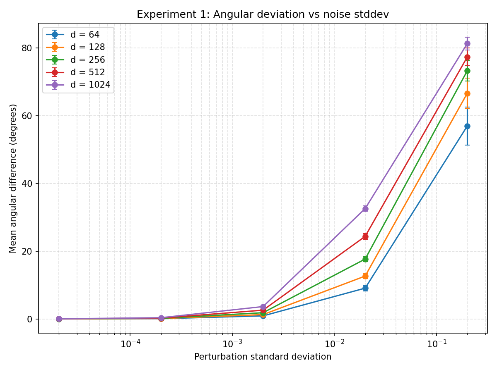
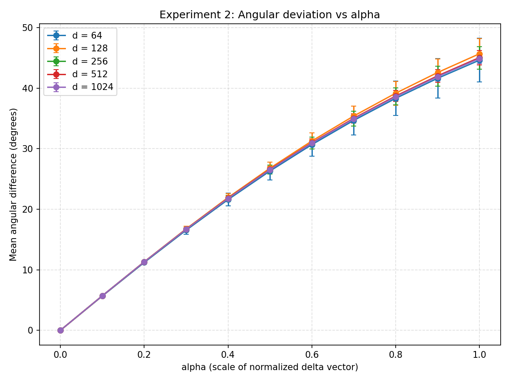

# Vector Angle Experiments

This repository contains a small experiment suite for exploring how
L2‑normalized vectors in high‑dimensional space change their direction under
different types of perturbations.

All experiments are run for vector dimensions

> 64, 128, 256, 512, 1024

and use Monte‑Carlo sampling to estimate average angular deviations and their
standard deviations.

---

## Experiments

### Experiment 1 – Gaussian noise stddev sweep

```markdown

```

For each dimension `d`:

1. Sample a base vector  
   \( x \sim \mathcal{N}(0, \sigma_\text{base}^2 I) \)  
   and L2‑normalize it.

2. For each noise stddev `σ_noise` in

   ```text
   [2e-5, 2e-4, 2e-3, 2e-2, 2e-1]
   ```

add Gaussian noise, renormalize, and measure the angle:

    ```text
    y = x + ε,          ε ~ N(0, σ_noise^2 I)
    ŷ = y / ||y||
    angle(x, ŷ)  (in degrees)
    ```

3. Repeat for `N` samples (default 100) and record the mean and stddev of the
   angular differences for each `(d, σ_noise)` pair.

**Outputs**

* Static PNG: `vector_angle_noise_std.png`
* Interactive HTML (zoomable): `vector_angle_noise_std.html`

The HTML file lets you zoom, pan, and hover for exact values.

---

### Experiment 2 – Alpha sweep along a random direction

For each dimension `d`:

1. Sample a base vector and a delta direction:

   ```text
   x  ~ N(0, σ_base^2 I)   -> L2-normalize
   δ  ~ N(0, σ_delta^2 I)  -> L2-normalize
   ```

2. For each scalar step size `alpha` in `[0.0, 0.1, ..., 1.0]`:

   ```text
   y = x + alpha * δ
   ŷ = y / ||y||
   angle(x, ŷ)  (in degrees)
   ```

3. Repeat for `N` samples (default 100) and record mean/stddev of the angle for
   each `(d, alpha)` pair.

**Outputs**

* Static PNG: `vector_angle_alpha.png`
* Interactive HTML: `vector_angle_alpha.html`

```markdown

```

---

## Requirements

* Python 3.8+
* [NumPy](https://numpy.org/)
* [Matplotlib](https://matplotlib.org/)
* [Plotly](https://plotly.com/python/) (only needed for the HTML/zoomable plots)

Install the dependencies with:

```bash
pip install numpy matplotlib plotly
```

---

## Running the experiments

The main script is:

```text
vector_angle_experiments.py
```

Basic usage with defaults:

```bash
python vector_angle_experiments.py
```

This will:

* Run both experiments.
* Print summary statistics to the console.
* Save:

  * `vector_angle_noise_std.png`
  * `vector_angle_noise_std.html`
  * `vector_angle_alpha.png`
  * `vector_angle_alpha.html`

in the current directory.

---

## Command‑line options

All options are handled via `argparse`:

```bash
python vector_angle_experiments.py \
  --base-std 0.02 \
  --delta-std 0.02 \
  --num-samples 100 \
  --seed 0 \
  --output-prefix vector_angle
```

* `--base-std`
  Stddev for the Gaussian initialization of the base vectors
  (default: `0.02`).

* `--delta-std`
  Stddev for the Gaussian initialization of the delta vectors in
  **Experiment 2** (default: `0.02`).

* `--num-samples`
  Number of random samples per `(dimension, std/alpha)` configuration
  (default: `100`).

* `--seed`
  Random seed for reproducibility (default: `0`).

* `--output-prefix`
  Prefix for all output file names (default: `vector_angle`).

For example, to increase the number of samples and change the stddevs:

```bash
python vector_angle_experiments.py \
  --base-std 0.05 \
  --delta-std 0.01 \
  --num-samples 1000 \
  --output-prefix hi_dim_experiment
```

---

## Output overview

After a run you should see something like:

* `vector_angle_noise_std.png` – static plot of mean angle vs noise stddev
* `vector_angle_noise_std.html` – interactive version of the same plot
* `vector_angle_alpha.png` – static plot of mean angle vs alpha
* `vector_angle_alpha.html` – interactive version of the alpha sweep

Open the `.html` files in your browser to zoom, pan, and inspect individual
curves per dimension.

